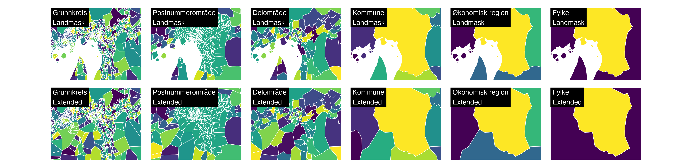
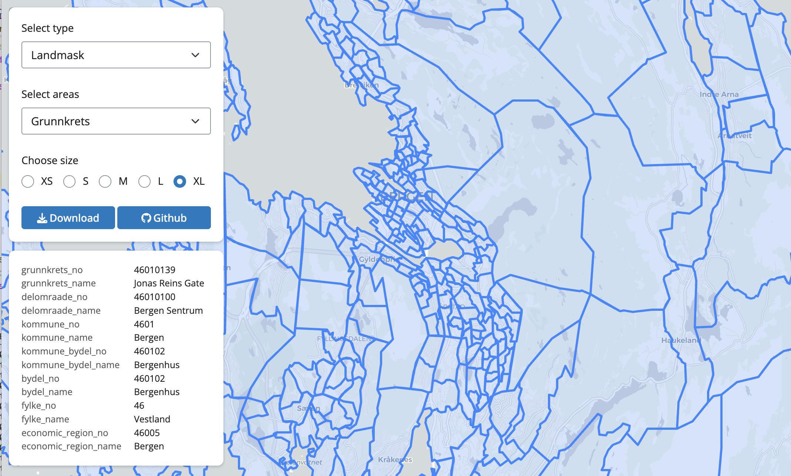

# Norwegian Administrative Maps

This repository contains simplified polygon boundaries for various
Norwegian administrative levels, designed for statistical visualization,
analysis, and mapping purposes. All maps preserve boundaries between
different administrative levels by aggregating polygons from the lowest
level.

## Map Versions

This repo provides administrative boundaries at multiple levels:

- **Grunnkrets** (Basic Statistical Unit Level 1)
- **Delområde** (Basic Statistical Unit Level 2)
- **Bydel** (Districts)
- **Kommune/Bydel** (Municipalities and Districts where available)
- **Kommune** (Municipalities)
- **Fylke** (Counties)
- **Økonomisk region** (Economic Region)
- **Postnummerområde** (Zip Code Region)

Maps are available in two variants:

- **Landmask**: Contains the clipped Norwegian coastline
- **Extended**: Extends into the maritime border

## Demo

This
[app](https://shinylive.io/py/app/#h=0&code=NobwRAdghgtgpmAXGKAHVA6VBPMAaMAYwHsIAXOcpMAMwCdiYACAZwAsBLCbJjmVYnTJMAgujxMArhwl04UQmQ4A3OLMoATOHXUBHADoR6jXjgA28mheF8BQpgFk0EgOJxiAKQDKAeQByEgAyUNjaLADCpGQMZhIAKhwWwaE6TAAKxKiSqIbGzOxc2ADuHBoA5nBkLLz8gsLEkmRZZAD6JeWV6hBadG2lFWS5DMw0UBwkENW2dbwTLSzKZUMmHDjtA1O19gAScQ6BhtP2crqScCxVh1vCAFYspFd2whCS-DxQ1RA5EIaGWjRMABG0jMGhakjoZgAFDA0C0yNhUGomLDUC0oHIoBIWBwAF5wACUiEMTFJTDkZAhECYNH0YDYZCaLEQAHoWXQoEUMGUOGQ2JJgSxtBMKOQMCQYCy+cQ2FAIAAOeUsiCCAC0qJY7LgNE1bHkGk1sK4LI1LMIELk5BZIFR8MRcAAvtbbRj5A6WiAcfiHdz3HcHmBfj9utqgSCwTy+QLwZCYXCEUiJC7Mdi8YTidSyRSqTS6QymayWZH+YDxYwpWwZXLFcq1abAWZiICTWMIC3UJrzXRLWRnfH7U6bXDXVB3Z60z6KsR-T9A8G-qGBi0BGZsGVSC1CJQKHQoSRBAaiSSyfu6AamABeJhfDAYjnYPfEA8sYAABgAugTSQBiJgNHfklwZR-hAq7HqSZgQGUEhmFAwhXqeBrAIgEgfhIiEvihTAAIzvuB5KVDmwCwWQGDwHKUIEjBUFkfIECUXh87QOg4IcJeUgcFgUAVC0NCJLBDZwFC+HSBgepQGCIrblColkNxLAYEoZAWMJYB+IIRRwDycoomgLB0gSVEiZx4mSVE0n4WSHGKfJGAXNgKmWVZZJ0hggIsGYHCAqqqDcXAqp8WYZhMCAvkaBoQGIEwr5MAAhEccnkAA3A6dJOc5TCuTc2TYDuqrrJU1RDnQPIQFFMXxdccpkClaWZhlVmuaiqpcM0RW4i1IYAB6INhr79XFCXVbVc4NUwBL4UZ9V-o0zR9B0ZCqba-7NAZeDGVxEBwGY6LucQZiNEJ6XWYQGIaMJ01jaJp1ni0gLEBoD7HVdnGtY08zbXAigXWNv0uWAtoJnAdLrZdf3OXSXifYoTBAyDz3gyAdJwF1opaBodJRXSACiqOaHAGP4JlYCwd0sIsAA1pjxPBGTHxU2ADqg+Dv1ChYigExedKkxo5MM8zLNklNgtkqJb2tGzX2LQjf10sm8jw2DIuQ9Dwgjvp+Ay79SNKyL-1lHQkgQBAFMUhrWNgC4hvG6bhWK3rv10lojYwByEnA0gxMACLbYwdAAKdaPbDsNXSgLYM71N0gAQhH23ByHENgBTjAwEbcB3XHZhR2AADSqfpyyseR5rusO3SKcwGnW05-nVfpwnif-TQDkUx7FsAGKtx7AtN-9X2kIw4wtHIPIBhbAAbKcqjAHCUwRY+zr3ffE7iqw5wAWqsTCRFoGvLw7TNa2NkscxoXNgAbRsm2bjcs8Leti1870chFxB3Y0ZCkCwP1N3LcJeh7sfUOYBwiVmIEKVgaY756yRmALq5tiYAA0vAg2JogyGaC5Y5wcFgkmOcDhEzpF1bOns6RIMIUfMu4MuCeS2heOIhs1DANJA-EWolYLYH-JufarxJi-0TqJFa71pCqQ0MQIooFiASQ-oyAMbCQ5CNmiIjgqlizRmBHI2cCiHZlDQBeAAzAfcGOiGqmIyno1AF5XzGNYbYpg7Q+QXwAEwAE5XyoC6jA0kX8rF0j6p47xTALA0DIBfAJXjS5jQ0ByMoejBIXg7lAMwQp7GEFgiwFgLQL7NXFtUFgsIgqNwUaJXyW0dpQD2gdCgAjnJKKaCo1SNB5CUjkGtY6ji2AuPcYEqJDV7pyJgOEjxkT7EhLCf4kZQSYncXiRYRJyTUnHXSR8LJOS0CdTaqwQppDl4KMCgJCwLQYBNkSHABhTDQYTSYv8Vg2hVC7nFhIYRZBsTnBxKQI800uw9haFOGcy4MRCjBBoOCUB2KYkUCoOAGAABqySzhQnUlta5Vkfnbj+X6e4EAR6cnhCjeCBEFBKFUHChFQlkWEnwui8gmLpzYt4i0iEcAIXyChaS+FB0KWkCpcGKyzArxOFQHubc2gLxQgAGwAFYMBSokNhbCGBXxUSYLiJ8Qy5WsEIDEHaRQ9TbRaGqxgFyziorJDAW84ValWQSEkEI2hrUNWgPAC+0cPhwFREEqySgjmAIvFK7Czj7FWSNTAFoxAaA6kqBeVU2Fg1ki0BQRQI9KhcCgCa5h1DSQQjMBffMHZCylkBO6jU4oMRf0IBoCAZZJSeTKAydEQVrS4kHF1Qc2AHQAAFnFdSwFBIJZrWFBispuC0GLbScO0OGwENwpbsUpcOsknaXn4U7ZaHo80Bj4VuctZRi0vljWzHQakMBF2kjXWyklMLtTNMUKuyFV6MBwFUOQKE4syIALTBId9gN7TfufqReWUBB1MFueCVAoKKDHLhJO3cB6nWkEbKdYKo7uzjpg-a3oTZZ13t1icN9AGP1oiBpRf9zQiPokxKR3ghHbSAMotc46Ob2LAkSGCHNBHyO-qRNRn9w4qMqr42iejhljqwZaM6llV5aRgBAEJyj8hKIOiYFCOTtHP34iUxNOcHTeRsGsmkBgBt3kwi4NYpMUAuoXmwl+D4TBUAZhZpgIUi14CZL8heGTgRpERSgiFcTkmfQYAwAZM9v1ojYEc3rOQLBUCstOOcKovpFo5okEoeA-5DHKpYQRWLGAORzwzjQQQ8w5KUh-iBlmFBUasry9VwYWbnKQfBVeGcGBGwSR-vVyr4NYPsTcJ4XwfgoTNYvM1iQkmLwBdgLynLNLWj-IZRyIo+LUZ2UqFCbrc2x20sWxuXydBgUtGa+txazXGONashwAEqHfkTsw9OnDZAouJwtXIE5qgWiwahLd9DaJxPYalhdh2tyNyVgeS0WU3QLC7mfduCQzS4LMokAAKhRxTIoGIygsHg4na715iDCER60llghiZTngBFukBObDUmJ8yl7K8j1MT7qgBgHZ2L07kMl1SbPMjaCUOcNBIAHQ9ZFnJQSI8JHVCvGlMAGAbjEC4I6xOMm5cAB5ohMBWZki+BTknBXq6qFURQOQ5DAAAPk1xobXGSWAXyN2nCgNvUDeRih2VU7uyCe7pBbkAFMHTq6lBoK3ZAbc6-t3SVAPvLcgGUIH4PVupR0At3LuqK8yTFboEwCmEhlA0fs+zhSvIPUVZy1ZMXgspLkE52n0aGemDq4isoVPl29aa8qRYW3qyHed5ZRLiwqoCkohj63hv2sB8ZwYEUFgqU28iyD5PsfDeg-N+X4nOv5eTw7YW1ijcXOYUucfOQbcwO9awYwGD4gDyoRX4h1DjQMOz8iwtRJME33YOV7Gr92l92UiPbnSvFgzCyc1OyhGUHJWsyTHeQ8zpG8wkm10YFQGsBhVC0axRi3FQGEFxkwKUFICYDszgEZxZnmzpQBWW1W1IiP0pS-walIL2xxQOyOxO2oJ5VoIylEhVCUD4lOjwJxXYAkShAuFhxVSBgvm0AYDoDQQ0AhDgg4FIAvAlXYOcmcw2wgK5SgJRBgIqAvngJt1GDOQ0BCzAGfyYAvRDDoAwHEUkQ63OmOkCkoBmym1gEBFBSihkzUy437B4wJDHHkxHCUw9HkxE0nD31nEmnwg+GwAgEIFA1DGsKkRkQYMomILJGwA4G2nDx3zIKWzxXqx5wJCfRiIeiOjAEaBoFVHlDQPvXxksOkG3VDAPxSOOnx3oLCMZSRzkEol4GqEpVSIymZyYAXTw0ImPROjOhVzqU4hujBHukekmJegwF2H2D3GyIYI6JJwY3jSHV1lMPMJ6AwHqOmluQSNsNkS-nolx2ckGIWNFk4lOJ83ONIFuIyidgkUSIjDCK9RAS9neNsO+IynGAUKBP4MWDET+J83aXn270yWyTDjIGpEBARKH2YCRIgB8joD4AxGwABPGnsT2PXW0EOI4AaIBHUUBCeMuP6KkEhBY3DD+T02jA43kxI0E3UzRACLZK8OEzTAY2OkGNEigBeOsliwohBPmDBLpHJLWmJhcEZMBChJZjYDkBoAvFSy1gjzhLADRKBGROHzRIxKxLoBxL6T+jkhKmjTDlJgZmOgu0MDQDiyvDEGFQdNYjeToAeWuUZjwHAEk2oBOGkHe23AUjIFRnwCIHMioGQF-A7jJwKG4E8lJXkMQP4DkMBESF5BxIgF-HzWZDZHJJrRZAEBxG9y0GUCLOwCH04G4AKiqBZDnhYDOE1GwgAHYAAWQweM4ofoQqC8axDAAxDANsxmd8IAA)
shows available maps and qualities.

## Map Quality

Current maps are available in multiple quality levels, representing
polygon reduction:

- **xs**: 99.9% reduction (smallest file size)
- **s**: 99.5% reduction
- **m**: 99% reduction
- **l**: 95% reduction
- **xl**: 90% reduction (highest detail)

Historical maps dating back to 2002 are available in **xs** quality only
to keep repository size manageable.

## Available Data

| Area | Landmask | Extended |
|:---|:---|:---|
| Grunnkrets | [xs](https://raw.githubusercontent.com/thohan88/nor-maps/refs/heads/main//maps/current/landmask/grunnkrets_xs.geojson) [s](https://raw.githubusercontent.com/thohan88/nor-maps/refs/heads/main//maps/current/landmask/grunnkrets_s.geojson) [m](https://raw.githubusercontent.com/thohan88/nor-maps/refs/heads/main//maps/current/landmask/grunnkrets_m.geojson) [l](https://raw.githubusercontent.com/thohan88/nor-maps/refs/heads/main//maps/current/landmask/grunnkrets_l.geojson) [xl](https://raw.githubusercontent.com/thohan88/nor-maps/refs/heads/main//maps/current/landmask/grunnkrets_xl.geojson) | [xs](https://raw.githubusercontent.com/thohan88/nor-maps/refs/heads/main//maps/current/extended/grunnkrets_xs.geojson) [s](https://raw.githubusercontent.com/thohan88/nor-maps/refs/heads/main//maps/current/extended/grunnkrets_s.geojson) [m](https://raw.githubusercontent.com/thohan88/nor-maps/refs/heads/main//maps/current/extended/grunnkrets_m.geojson) [l](https://raw.githubusercontent.com/thohan88/nor-maps/refs/heads/main//maps/current/extended/grunnkrets_l.geojson) [xl](https://raw.githubusercontent.com/thohan88/nor-maps/refs/heads/main//maps/current/extended/grunnkrets_xl.geojson) |
| Delområde | [xs](https://raw.githubusercontent.com/thohan88/nor-maps/refs/heads/main//maps/current/landmask/delomraade_xs.geojson) [s](https://raw.githubusercontent.com/thohan88/nor-maps/refs/heads/main//maps/current/landmask/delomraade_s.geojson) [m](https://raw.githubusercontent.com/thohan88/nor-maps/refs/heads/main//maps/current/landmask/delomraade_m.geojson) [l](https://raw.githubusercontent.com/thohan88/nor-maps/refs/heads/main//maps/current/landmask/delomraade_l.geojson) [xl](https://raw.githubusercontent.com/thohan88/nor-maps/refs/heads/main//maps/current/landmask/delomraade_xl.geojson) | [xs](https://raw.githubusercontent.com/thohan88/nor-maps/refs/heads/main//maps/current/extended/delomraade_xs.geojson) [s](https://raw.githubusercontent.com/thohan88/nor-maps/refs/heads/main//maps/current/extended/delomraade_s.geojson) [m](https://raw.githubusercontent.com/thohan88/nor-maps/refs/heads/main//maps/current/extended/delomraade_m.geojson) [l](https://raw.githubusercontent.com/thohan88/nor-maps/refs/heads/main//maps/current/extended/delomraade_l.geojson) [xl](https://raw.githubusercontent.com/thohan88/nor-maps/refs/heads/main//maps/current/extended/delomraade_xl.geojson) |
| Bydel | [xs](https://raw.githubusercontent.com/thohan88/nor-maps/refs/heads/main//maps/current/landmask/bydel_xs.geojson) [s](https://raw.githubusercontent.com/thohan88/nor-maps/refs/heads/main//maps/current/landmask/bydel_s.geojson) [m](https://raw.githubusercontent.com/thohan88/nor-maps/refs/heads/main//maps/current/landmask/bydel_m.geojson) [l](https://raw.githubusercontent.com/thohan88/nor-maps/refs/heads/main//maps/current/landmask/bydel_l.geojson) [xl](https://raw.githubusercontent.com/thohan88/nor-maps/refs/heads/main//maps/current/landmask/bydel_xl.geojson) | [xs](https://raw.githubusercontent.com/thohan88/nor-maps/refs/heads/main//maps/current/extended/bydel_xs.geojson) [s](https://raw.githubusercontent.com/thohan88/nor-maps/refs/heads/main//maps/current/extended/bydel_s.geojson) [m](https://raw.githubusercontent.com/thohan88/nor-maps/refs/heads/main//maps/current/extended/bydel_m.geojson) [l](https://raw.githubusercontent.com/thohan88/nor-maps/refs/heads/main//maps/current/extended/bydel_l.geojson) [xl](https://raw.githubusercontent.com/thohan88/nor-maps/refs/heads/main//maps/current/extended/bydel_xl.geojson) |
| Kommune/Bydel | [xs](https://raw.githubusercontent.com/thohan88/nor-maps/refs/heads/main//maps/current/landmask/kommune_bydel_xs.geojson) [s](https://raw.githubusercontent.com/thohan88/nor-maps/refs/heads/main//maps/current/landmask/kommune_bydel_s.geojson) [m](https://raw.githubusercontent.com/thohan88/nor-maps/refs/heads/main//maps/current/landmask/kommune_bydel_m.geojson) [l](https://raw.githubusercontent.com/thohan88/nor-maps/refs/heads/main//maps/current/landmask/kommune_bydel_l.geojson) [xl](https://raw.githubusercontent.com/thohan88/nor-maps/refs/heads/main//maps/current/landmask/kommune_bydel_xl.geojson) | [xs](https://raw.githubusercontent.com/thohan88/nor-maps/refs/heads/main//maps/current/extended/kommune_bydel_xs.geojson) [s](https://raw.githubusercontent.com/thohan88/nor-maps/refs/heads/main//maps/current/extended/kommune_bydel_s.geojson) [m](https://raw.githubusercontent.com/thohan88/nor-maps/refs/heads/main//maps/current/extended/kommune_bydel_m.geojson) [l](https://raw.githubusercontent.com/thohan88/nor-maps/refs/heads/main//maps/current/extended/kommune_bydel_l.geojson) [xl](https://raw.githubusercontent.com/thohan88/nor-maps/refs/heads/main//maps/current/extended/kommune_bydel_xl.geojson) |
| Kommune | [xs](https://raw.githubusercontent.com/thohan88/nor-maps/refs/heads/main//maps/current/landmask/kommune_xs.geojson) [s](https://raw.githubusercontent.com/thohan88/nor-maps/refs/heads/main//maps/current/landmask/kommune_s.geojson) [m](https://raw.githubusercontent.com/thohan88/nor-maps/refs/heads/main//maps/current/landmask/kommune_m.geojson) [l](https://raw.githubusercontent.com/thohan88/nor-maps/refs/heads/main//maps/current/landmask/kommune_l.geojson) [xl](https://raw.githubusercontent.com/thohan88/nor-maps/refs/heads/main//maps/current/landmask/kommune_xl.geojson) | [xs](https://raw.githubusercontent.com/thohan88/nor-maps/refs/heads/main//maps/current/extended/kommune_xs.geojson) [s](https://raw.githubusercontent.com/thohan88/nor-maps/refs/heads/main//maps/current/extended/kommune_s.geojson) [m](https://raw.githubusercontent.com/thohan88/nor-maps/refs/heads/main//maps/current/extended/kommune_m.geojson) [l](https://raw.githubusercontent.com/thohan88/nor-maps/refs/heads/main//maps/current/extended/kommune_l.geojson) [xl](https://raw.githubusercontent.com/thohan88/nor-maps/refs/heads/main//maps/current/extended/kommune_xl.geojson) |
| Fylke | [xs](https://raw.githubusercontent.com/thohan88/nor-maps/refs/heads/main//maps/current/landmask/fylke_xs.geojson) [s](https://raw.githubusercontent.com/thohan88/nor-maps/refs/heads/main//maps/current/landmask/fylke_s.geojson) [m](https://raw.githubusercontent.com/thohan88/nor-maps/refs/heads/main//maps/current/landmask/fylke_m.geojson) [l](https://raw.githubusercontent.com/thohan88/nor-maps/refs/heads/main//maps/current/landmask/fylke_l.geojson) [xl](https://raw.githubusercontent.com/thohan88/nor-maps/refs/heads/main//maps/current/landmask/fylke_xl.geojson) | [xs](https://raw.githubusercontent.com/thohan88/nor-maps/refs/heads/main//maps/current/extended/fylke_xs.geojson) [s](https://raw.githubusercontent.com/thohan88/nor-maps/refs/heads/main//maps/current/extended/fylke_s.geojson) [m](https://raw.githubusercontent.com/thohan88/nor-maps/refs/heads/main//maps/current/extended/fylke_m.geojson) [l](https://raw.githubusercontent.com/thohan88/nor-maps/refs/heads/main//maps/current/extended/fylke_l.geojson) [xl](https://raw.githubusercontent.com/thohan88/nor-maps/refs/heads/main//maps/current/extended/fylke_xl.geojson) |
| Økonomisk region | [xs](https://raw.githubusercontent.com/thohan88/nor-maps/refs/heads/main//maps/current/landmask/economic_region_xs.geojson) [s](https://raw.githubusercontent.com/thohan88/nor-maps/refs/heads/main//maps/current/landmask/economic_region_s.geojson) [m](https://raw.githubusercontent.com/thohan88/nor-maps/refs/heads/main//maps/current/landmask/economic_region_m.geojson) [l](https://raw.githubusercontent.com/thohan88/nor-maps/refs/heads/main//maps/current/landmask/economic_region_l.geojson) [xl](https://raw.githubusercontent.com/thohan88/nor-maps/refs/heads/main//maps/current/landmask/economic_region_xl.geojson) | [xs](https://raw.githubusercontent.com/thohan88/nor-maps/refs/heads/main//maps/current/extended/economic_region_xs.geojson) [s](https://raw.githubusercontent.com/thohan88/nor-maps/refs/heads/main//maps/current/extended/economic_region_s.geojson) [m](https://raw.githubusercontent.com/thohan88/nor-maps/refs/heads/main//maps/current/extended/economic_region_m.geojson) [l](https://raw.githubusercontent.com/thohan88/nor-maps/refs/heads/main//maps/current/extended/economic_region_l.geojson) [xl](https://raw.githubusercontent.com/thohan88/nor-maps/refs/heads/main//maps/current/extended/economic_region_xl.geojson) |
| Postnummerområde | [xs](https://raw.githubusercontent.com/thohan88/nor-maps/refs/heads/main//maps/current/landmask/zip_xs.geojson) [s](https://raw.githubusercontent.com/thohan88/nor-maps/refs/heads/main//maps/current/landmask/zip_s.geojson) [m](https://raw.githubusercontent.com/thohan88/nor-maps/refs/heads/main//maps/current/landmask/zip_m.geojson) [l](https://raw.githubusercontent.com/thohan88/nor-maps/refs/heads/main//maps/current/landmask/zip_l.geojson) [xl](https://raw.githubusercontent.com/thohan88/nor-maps/refs/heads/main//maps/current/landmask/zip_xl.geojson) | [xs](https://raw.githubusercontent.com/thohan88/nor-maps/refs/heads/main//maps/current/extended/zip_xs.geojson) [s](https://raw.githubusercontent.com/thohan88/nor-maps/refs/heads/main//maps/current/extended/zip_s.geojson) [m](https://raw.githubusercontent.com/thohan88/nor-maps/refs/heads/main//maps/current/extended/zip_m.geojson) [l](https://raw.githubusercontent.com/thohan88/nor-maps/refs/heads/main//maps/current/extended/zip_l.geojson) [xl](https://raw.githubusercontent.com/thohan88/nor-maps/refs/heads/main//maps/current/extended/zip_xl.geojson) |

## Usage

### Direct Download

All maps can be directly accessed via raw GitHub URLs: Use the
`current`-folder to retrieve latest version, or use the
`versioned`-folder if you prefer maps to be freezed.

    https://raw.githubusercontent.com/thohan88/nor-maps/refs/heads/main/maps/current/landmask/kommune_s.geojson

## Attribution

- Administrative hierarchies are sourced from Statistics Norway’s
  [Statistical
  Codelists](https://data.ssb.no/api/klass/v1/api-guide.html)
- Administrative borders are obtained from
  [Geonorge](https://www.geonorge.no/)
- Historical SOSI-format files were converted using
  [SOSICON](https://github.com/espena/sosicon)
- Maps are simplified using
  [Mapshaper](https://github.com/mbloch/mapshaper)
